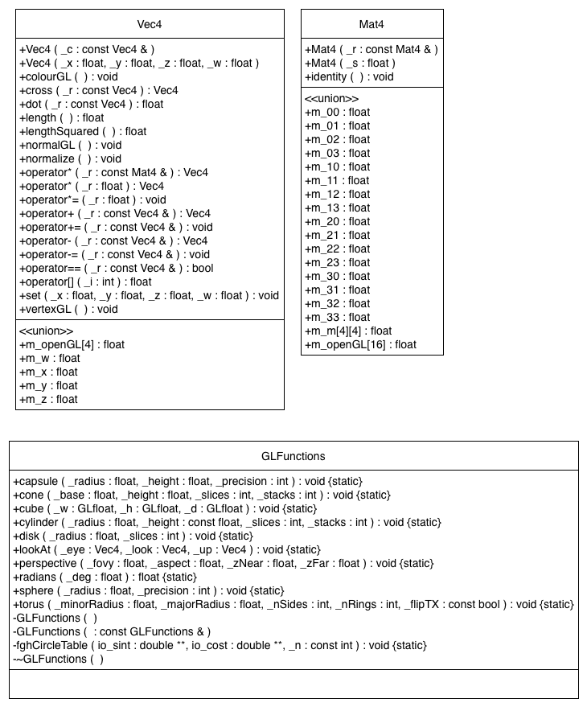
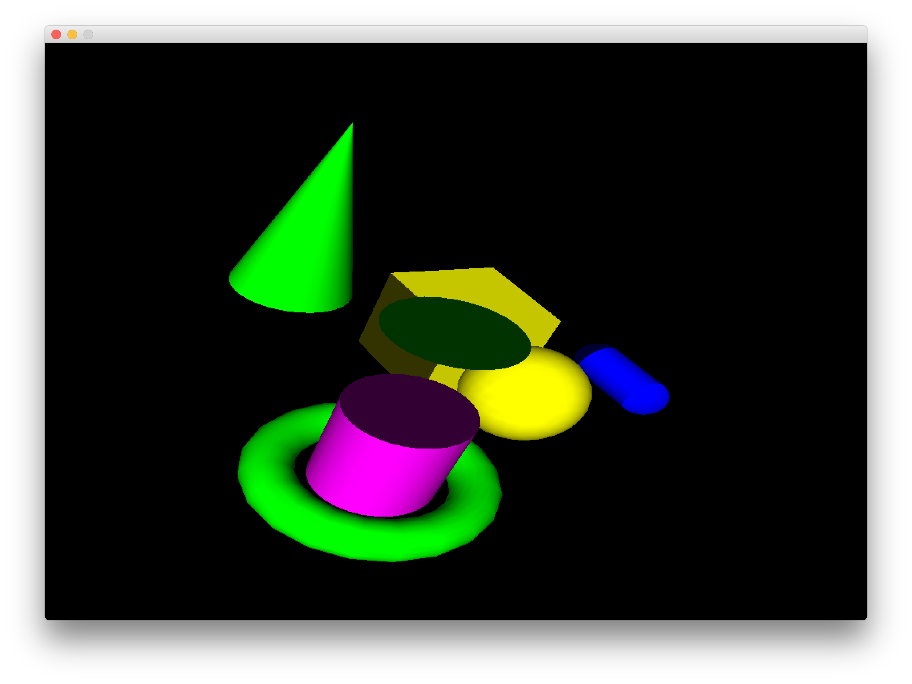

#GLFunctions
This is the boilerplate code for the lab session in generating classes and introducing you to developing static libraries.

You will need to write Mat4 and Vec4 classes based on the class diagrams below. This UML diagrams show the methods that need to be implemented. I suggest starting with just the method names to get the basic lib to compile. Once this is done start writing the actual code.

Note that the code will not initially compile so you will have to create the source and header files first.

The function `void normalGL();` will call `glNormal3f(m_x, m_y, m_z);`

The function `void vertexGL();` will call `glVertex3f(m_x, m_y, m_z);`

The function `void colourGL();` will call `glColor4fv(m_openGL);`

The final output of the program should look like this

